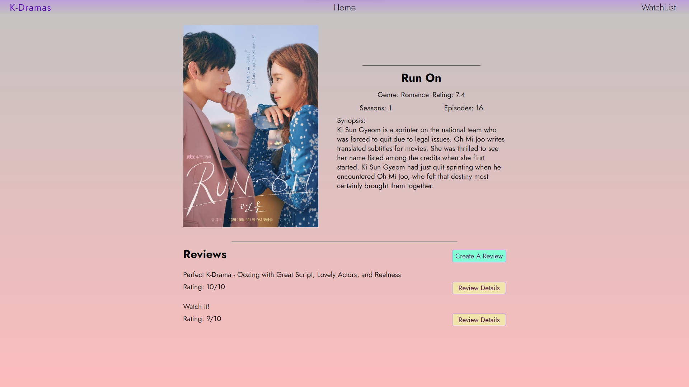

# Jonathan Navarro - KDramas Watchlist
Hello, thank you for checking out my project.  
This is a fullstack application, a MEN-Stack CRUD app to be specific.  
The app was made to display a list of K-dramas. You can add specific K-dramas to your watchlist.  
You can also view reviews, which show the k-drama details and reviews for the selected drama.  
You can edit, create, or delete reviews.

## App Screenshots
### Home Page

### Reviews Index

### Review Details

### Edit Review Page(Create Review Page Is Similar)

### Watchlist Page

## List of Technologies used
- MongoDB/Mongoose
- Express
- NodeJS
- EJS
- CSS
- Chrome DevTools
- Google

## Installation Intstructions
View App Without Installing
- https://kdramas-4e345146c0e4.herokuapp.com

Instructions to use VSCode for a local deploy of the app  
Requirements:
- GitHub Account, Git, VSCode, MongoDB Atlas Account  

Steps:
1. Fork & Clone this repo to your machine
2. CD the repo
3. Run `npm i`
4. Run `code .`
5. Create a `.env` file at root location
6. Open the file and add the following lines
    - `PORT=3000`
    - `MONGODBURI="Your MongoDB Atlas connection string"`
    - `ON_HEROKU=false`
7. Open VSCode terminal by pressing ctrl + `
8. Run `npm run start`
9. Open a browser of your choosing and search:
    - http://localhost:3000
10. Enjoy

## User Stories
- As the teacher of the student, I want to make sure the student used all previous knowledge they have been taught throughout unit 1 and 2.

- As a friend of the student, I want to make sure that the student has been making good use of their time and that the cohort was a good fit for them.

- As a fellow member of the cohort, I would like to see a professionally styled full stack application that is responsive.

## Wireframes
  

## Unsolved Problems & Major Hurdles
The only problem I had was constantly finding new things to style and/or change.  
This project really solidified my understanding of CSS, I now understand what I need to do in order to get an element in a certain position.  
CSS Flex was a lifesaver when it came to displaying cards, but I really need to research CSS Grid more.

## Resources
For the K-Drama pictures(posters): https://www.themoviedb.org/?language=en-US
For Synopses: https://www.wikipedia.org